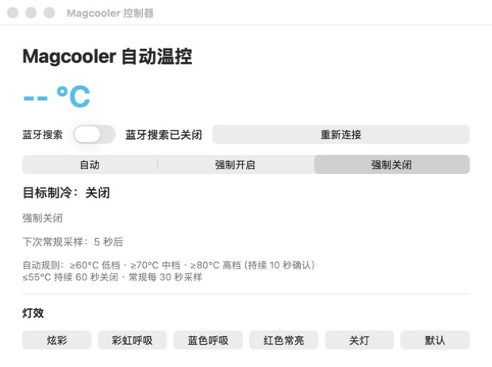

# Magcooler 自动温控

> 让一个在抽屉里吃灰多年的手机散热器，重新找到一份 Mac 的工作。

这不是一个从宏大愿景开始的项目。

它的起点，只是我翻出了一个几年前买的红魔散热器。硬件没坏，制冷片也依然很猛，但它已经很久没有正经用途了：给手机用嫌麻烦，扔掉又觉得可惜。与此同时，Mac 一忙起来温度就往上窜，而散热器明明就在旁边吃灰。

我突然意识到：它缺的不是性能，只是缺一个愿意替它盯着 CPU 温度的人。

于是有了这个小工具。



## 它现在能做什么

- 直接读取 Apple 芯片的 CPU 温度，不依赖 Macs Fan Control 常驻或提供接口。
- 通过蓝牙控制 Redmagic Magcooler 的开关、低中高三档和灯效。
- CPU 平均温度达到 60 / 70 / 80°C 并持续 10 秒后，自动切换到低 / 中 / 高档。
- 温度不高于 55°C 并持续 60 秒后自动关闭，避免散热器一直空转。
- 支持“自动 / 强制开启 / 强制关闭”三种模式。
- 蓝牙断线后自动重连，并恢复之前的档位和灯效。
- 散热器不在附近时，可以关掉“蓝牙搜索”，让它安静待命，不再满世界找一个根本没开机的设备。

## 这个软件是怎么长出来的

第一版其实很朴素：Mac 能连接散热器，按钮能控制档位和灯光，就算成功。

真正让它变得有用的，是后来冒出来的那个问题：既然 Mac 已经知道自己有多热，为什么还要我亲自盯着温度，再手动打开散热器？

我先研究了 Macs Fan Control，确认 Mac 上确实能稳定拿到 CPU 传感器数据。但两个应用硬绑在一起并不优雅，所以最终选择直接读取 macOS 的 IOHID 温度传感器。这样少一个依赖，也少一个“到底是谁没启动”的排查现场。

接下来是最有意思的一段：原控制器没有公开协议，我把红魔 Android APK 拆开，沿着蓝牙服务和特征值一路找到控制指令，再与原 Mac 控制器的行为交叉验证。最终确认了开关、三档制冷和灯效对应的数据。一个几年前的手机配件，就这样被重新接回了现在的 Mac。

自动控制也不是简单写几个 `if`：温度会瞬间跳动，蓝牙会断，散热器可能根本不在房间里。于是又陆续加上了 10 秒确认、60 秒低温关闭、30 秒常规采样、断线恢复，以及最后这个非常现实的“别再搜了”开关。

整个过程大概可以概括成：

```text
抽屉里的旧硬件
    ↓
“扔了可惜，要不接到 Mac 上？”
    ↓
拆 APK、找蓝牙协议、读温度传感器
    ↓
处理抖动、断线和设备不在场
    ↓
一台终于重新上岗的散热器
```

它没有把旧硬件变成什么黑科技，只是让一件本来还能工作的东西，不必因为软件缺席而提前退休。这也是我做它最开心的地方。

## 自动温控规则

| CPU 平均温度 | 持续时间 | 动作 |
| --- | ---: | --- |
| ≥ 80°C | 10 秒 | 高档制冷 |
| ≥ 70°C | 10 秒 | 中档制冷 |
| ≥ 60°C | 10 秒 | 低档制冷 |
| ≤ 55°C | 60 秒 | 关闭制冷 |

应用每 30 秒进行一次常规采样；达到开启阈值时，会在 10 秒后增加一次确认采样，兼顾日常开销和响应速度。55–60°C 区间保持当前状态，避免在临界温度附近反复启停。

## 使用方法

1. 打开 `Magcooler 控制器.app`。
2. 选择“自动”模式。
3. 散热器在附近并已开机时，打开“蓝牙搜索”。
4. 首次连接按 macOS 提示允许蓝牙访问。

不使用散热器时，关闭“蓝牙搜索”即可。CPU 温控仍会继续计算目标状态；下次重新开启蓝牙后，应用会连接设备并恢复对应档位。

## 从源码构建

环境要求：macOS 12 或更高版本、Xcode Command Line Tools。温度读取目前针对 Apple Silicon 传感器实现。

```bash
./test.sh
./build.sh
```

构建产物位于：

```text
build/Magcooler 控制器.app
```

项目没有第三方运行时依赖。构建脚本会生成 Universal Binary（Apple Silicon + Intel）、打包图标并进行本机临时签名；CPU 温度读取功能以 Apple Silicon 为主要测试目标。

## 关于这个项目

这是一个为了盘活个人闲置硬件而做的小工具，并非红魔官方项目。不同型号的散热器可能使用不同协议，请不要在未确认协议的设备上直接尝试控制指令。

如果它也让你抽屉里的某件旧设备重新上岗，那这次折腾就不只救活了一台散热器。
